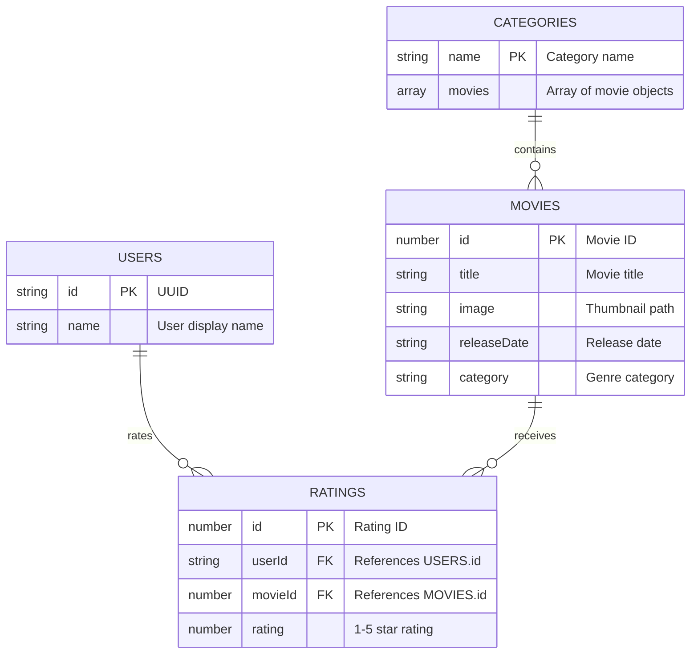

## Database Schema

## Installation
1. bun install
2. bun dev
3. Open http://localhost:3000

## API
- `POST /api/movies`
- `GET /api/users`
- `POST /api/movies/[movieId]/rate`

## Tech Stack
- **Database**: JSON files as mockup database
- **State Management**: Zustand
- **UI Framework**: Shadcn/ui + Tailwind CSS
